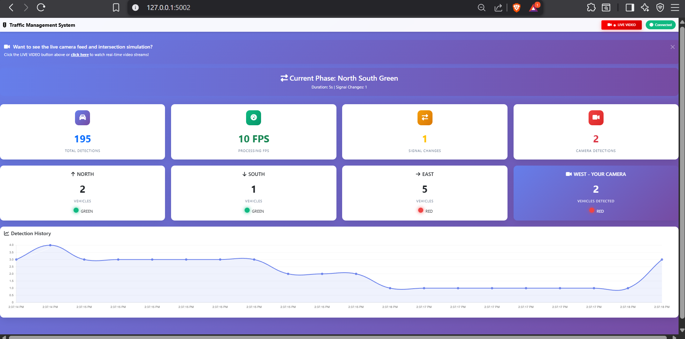
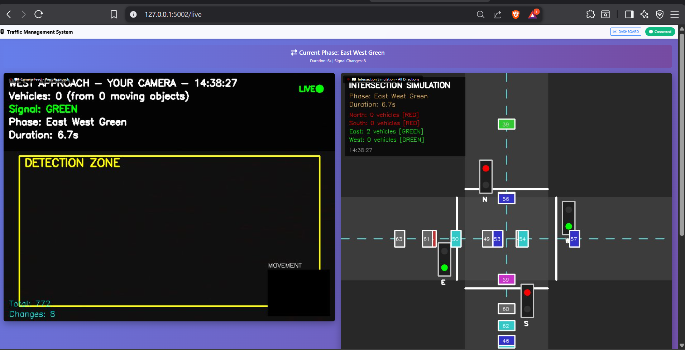

# 🚦 Adaptive Traffic Management System

A real-time traffic management system with AI-powered vehicle detection, adaptive signal control, and live visualization.

## ✨ Features

### 🎥 Live Camera Detection
- Real-time vehicle detection using OpenCV
- Background subtraction algorithm
- Confidence scoring and tracking
- West approach monitoring

### 🚦 Adaptive Traffic Control
- Dynamic signal timing based on traffic density
- 4-way intersection management
- Minimum/maximum green time constraints
- Smart phase transitions

### 📊 Live Visualization
- **Dual OpenCV Windows**: Camera feed + Intersection simulation
- **Web Dashboard**: Real-time statistics and charts
- **Live Video Streaming**: Camera and simulation streams to browser
- **Mobile Responsive**: Works on any device

### 🎬 Intersection Simulation
- Animated 4-way intersection
- Vehicles from all directions (North, South, East, West)
- Real-time traffic light synchronization
- Visual traffic flow representation

## 🚀 Quick Start

### Prerequisites
```bash
Python 3.8+
Webcam (for camera detection)
```

### Installation
```bash
# Clone repository
git clone <repository-url>
cd traffic-management-system

# Install dependencies
pip install -r requirements.txt

# Run the system
python run.py
```


### Access Points

| URL | Description |
|-----|-------------|
| `http://localhost:5002/` | Main dashboard with statistics |
| `http://localhost:5002/live` | Live video streams (camera + simulation) |
| `http://localhost:5002/video/camera` | Camera feed only |
| `http://localhost:5002/video/simulation` | Simulation only |

## 📸 Sample Dashboard Output

### Main Dashboard

*Real-time statistics, vehicle counts, and detection history charts*

### Live Video Dashboard

*Live camera feed and intersection simulation with animated vehicles*

**Features Shown:**
- 🎥 Live camera feed with vehicle detection
- 🚦 Animated 4-way intersection simulation
- 📊 Real-time statistics and metrics
- 🚗 Vehicle counts per direction
- 🔴 Traffic signal states (Red/Green)
- 📈 Detection history charts
- 📱 Responsive design for all devices

## 📱 Usage

### Local Access
1. Start the system: `python run.py`
2. Open browser: `http://localhost:5002/live`
3. Move in front of camera to test detection

### Remote Access (Same Network)
1. Find your IP: `ipconfig` (Windows) or `ifconfig` (Mac/Linux)
2. Share URL: `http://YOUR_IP:5002/live`
3. Anyone on your WiFi can access

### What You'll See

**Two OpenCV Windows:**
- Camera Feed - West Approach (your webcam)
- Intersection Simulation - All 4 directions

**Web Dashboard:**
- Live camera video stream
- Live intersection simulation
- Real-time statistics
- Vehicle counts per direction
- Traffic signal states
- Detection history charts

## 🎯 System Architecture

```
Camera → Detection → Traffic Controller → Visualization
   ↓         ↓              ↓                  ↓
OpenCV   Background    Adaptive Logic    OpenCV Windows
         Subtraction   Signal Timing     Web Streaming
```

### Components

**Camera Manager** (`app/core/camera.py`)
- Webcam initialization and frame capture
- Resolution and FPS configuration

**Vehicle Detector** (`app/core/detector.py`)
- Background subtraction (MOG2)
- Contour detection and filtering
- Vehicle counting and tracking

**Traffic Controller** (`app/core/traffic_controller.py`)
- Adaptive signal timing algorithm
- Phase management (East-West, North-South)
- Vehicle queue simulation

**Visualizer** (`app/core/visualizer.py`)
- Detection bounding boxes
- Information overlays
- Signal state indicators

**Intersection Visualizer** (`app/core/intersection_visualizer.py`)
- Animated 4-way intersection
- Vehicle spawning and movement
- Traffic light rendering

**Video Stream Manager** (`app/api/video_stream.py`)
- MJPEG streaming to web browsers
- Frame encoding and transmission
- Multi-client support

**Database** (`app/database/models.py`)
- SQLite storage
- Detection logging
- Signal event tracking
- Statistics generation


## 🔧 Configuration

Edit `app/config.py` to customize:

```python
# Camera Settings
CAMERA_WIDTH = 640
CAMERA_HEIGHT = 480
CAMERA_FPS = 30

# Traffic Control
MIN_GREEN_TIME = 6    # seconds
MAX_GREEN_TIME = 15   # seconds
BASE_GREEN_TIME = 8   # seconds

# Detection
MIN_VEHICLE_AREA = 200
MAX_VEHICLE_AREA = 15000
```

## 📊 API Endpoints

### Data APIs
- `GET /api/live-data` - Current traffic data (JSON)
- `GET /api/detections` - Detection history (JSON)
- `GET /api/statistics` - System statistics (JSON)
- `GET /api/health` - Health check (JSON)

### Video Streams
- `GET /video/camera` - Camera feed (MJPEG)
- `GET /video/simulation` - Simulation feed (MJPEG)

### Example Response
```json
{
  "intersections": {
    "North": {"vehicles": 2, "signal": "RED"},
    "South": {"vehicles": 3, "signal": "RED"},
    "East": {"vehicles": 4, "signal": "GREEN"},
    "West": {"vehicles": 1, "signal": "GREEN"}
  },
  "current_phase": "East_West_Green",
  "phase_duration": 8.5,
  "total_detections": 45,
  "signal_changes": 3
}
```

## 🎨 Features in Detail

### Adaptive Traffic Control Algorithm

The system uses a density-based adaptive algorithm:

1. **Vehicle Detection**: Count vehicles at each approach
2. **Queue Analysis**: Calculate waiting vehicles
3. **Dynamic Timing**: Adjust green time based on traffic
4. **Phase Switching**: Change signals when optimal

**Formula:**
```
Green Time = BASE_TIME + (vehicle_count × EXTENSION_FACTOR)
Constrained by: MIN_GREEN_TIME ≤ Green Time ≤ MAX_GREEN_TIME
```

### Vehicle Detection Process

1. **Background Subtraction**: Identify moving objects
2. **Morphological Operations**: Clean up noise
3. **Contour Detection**: Find vehicle boundaries
4. **Filtering**: Apply size and aspect ratio constraints
5. **Tracking**: Maintain detection history for stability

### Intersection Simulation

- **Vehicle Spawning**: Based on actual traffic counts
- **Movement**: Realistic speed and acceleration
- **Stop Zones**: Vehicles stop at red lights
- **Clearing**: Vehicles proceed on green
- **Visualization**: Color-coded vehicles with IDs


## 🛠️ Troubleshooting

### Camera Not Working
```bash
# Check camera availability
python -c "import cv2; print(cv2.VideoCapture(0).isOpened())"

# Try different camera index
# Edit app/config.py: CAMERA_INDEX = 1
```

### Port Already in Use
```bash
# Change port in run.py
app.run(host='0.0.0.0', port=5003)  # Use different port
```

### Video Streams Not Loading
1. Check browser console (F12) for errors
2. Verify system is running: `python run.py`
3. Try refreshing browser (Ctrl+F5)
4. Check firewall allows port 5002

### Slow Performance
- Reduce camera resolution in `app/config.py`
- Lower video quality in `app/api/video_stream.py`
- Close other applications
- Use wired connection instead of WiFi

## 📁 Project Structure

```
traffic-management-system/
├── app/
│   ├── api/
│   │   ├── routes.py           # Flask routes
│   │   └── video_stream.py     # Video streaming
│   ├── core/
│   │   ├── camera.py           # Camera management
│   │   ├── detector.py         # Vehicle detection
│   │   ├── traffic_controller.py  # Traffic logic
│   │   ├── visualizer.py       # OpenCV visualization
│   │   └── intersection_visualizer.py  # Simulation
│   ├── database/
│   │   └── models.py           # Database operations
│   ├── config.py               # Configuration
│   └── processor.py            # Main processing loop
├── templates/
│   ├── dashboard.html          # Main dashboard
│   └── dashboard_with_video.html  # Live video dashboard
├── legacy/
│   └── camera_feed_with_dashboard.py  # Original code
├── requirements.txt            # Python dependencies
├── run.py                      # Application entry point
└── README.md                   # This file
```

## 🎓 Use Cases

### Educational
- Traffic engineering demonstrations
- Computer vision projects
- IoT and smart city concepts
- Real-time systems learning

### Research
- Traffic flow analysis
- Algorithm testing
- Adaptive control strategies
- Performance benchmarking

### Development
- Prototype for smart city solutions
- IEEE/ACM project submissions
- Portfolio demonstrations
- Proof of concept


## 🔒 Security Notes

**Current Setup (Development):**
- ⚠️ No authentication
- ⚠️ No encryption (HTTP)
- ⚠️ Open to anyone with URL

**For Production:**
- Add authentication (Flask-HTTPAuth)
- Use HTTPS with SSL certificates
- Implement rate limiting
- Restrict access by IP
- Use environment variables for secrets

## 🚀 Performance

### System Requirements

**Minimum:**
- CPU: 2 cores
- RAM: 2 GB
- Camera: 640x480 @ 30 FPS
- Network: 10 Mbps

**Recommended:**
- CPU: 4 cores
- RAM: 4 GB
- Camera: 1280x720 @ 30 FPS
- Network: 50 Mbps

### Metrics

**Single User:**
- CPU: ~20-30%
- RAM: ~200 MB
- Bandwidth: ~1 MB/s

**Multiple Users (10 concurrent):**
- CPU: ~40-60%
- RAM: ~500 MB
- Bandwidth: ~10 MB/s

## 🤝 Contributing

Contributions are welcome! Areas for improvement:

- [ ] Multiple camera support (4 cameras for all directions)
- [ ] Deep learning detection (YOLO, SSD)
- [ ] Turn movement tracking (left, right, straight)
- [ ] Pedestrian detection and crossings
- [ ] Emergency vehicle priority
- [ ] Historical data analysis
- [ ] Mobile app
- [ ] Cloud deployment options

## 📄 License

This project is licensed under the MIT License - see the LICENSE file for details.

## 🙏 Acknowledgments

- OpenCV for computer vision capabilities
- Flask for web framework
- Chart.js for data visualization
- Bootstrap for responsive UI

## 📞 Support

For issues, questions, or suggestions:
- Open an issue on GitHub
- Check existing documentation
- Review troubleshooting section

## 🎉 Quick Reference

**Start System:**
```bash
python run.py
```

**Access Locally:**
```
http://localhost:5002/live
```

**Share on Network:**
```
http://YOUR_IP:5002/live
```

**Stop System:**
- Press 'q' in OpenCV window
- Or Ctrl+C in terminal

---

**Built with ❤️ for smart traffic management**
